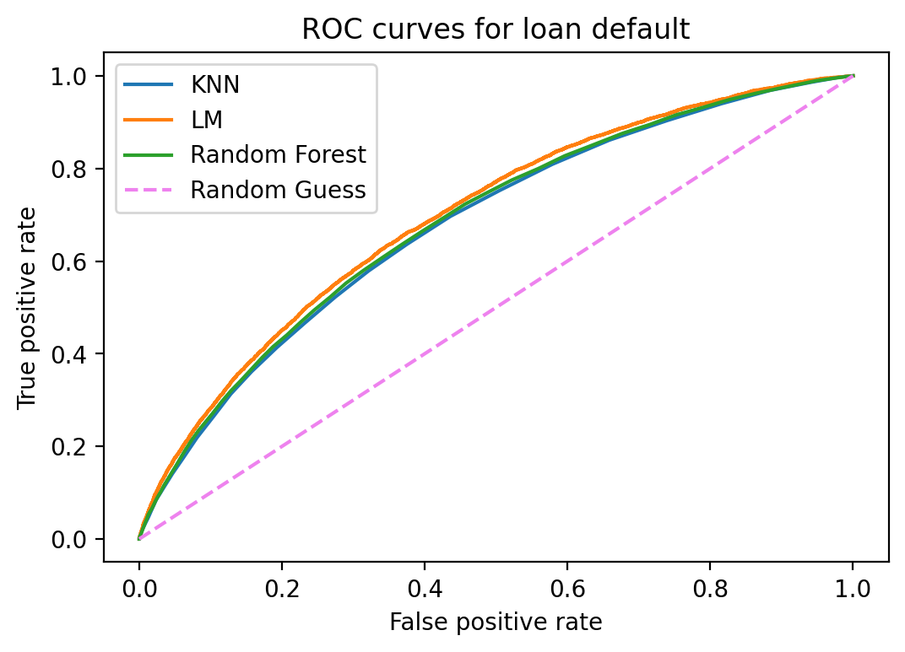

# Loan Default Classification

#### Manveer Sadhal
#### Oct 25, 2021

## Question
The question this project intends to answer is whether a given loan in the current portfolio of loans at Interested Lending, Inc. will default.

## Data
### Cleaning
The initial data set was comprised of 887,379 entries. For the purposes of this classification project, only loans that have closed (fully paid or default status) were considered.

After removing active loans from the data set, 252,971 loans remained.

### Feature Engineering
The original data set included 73 columns, many of which were irrelevant to the question at hand and/or were comprised primarily of null values. A smaller data set with 17 columns was created.

Categorical features for the loan term and the loan grade were converted to dummies.

For the numeric features, the following correlations were seen between with the target (loan status):

<table>
    <thead>
        <tr>
            <th>Feature</th>
            <th>Correlation Coefficient (Absolute Values)</th>
        </tr>
    </thead>
    <tbody>
        <tr>
            <td>Interest Rate</td>
            <td>0.239</td>
        </tr>
        <tr>
            <td>Debt-to-Income Ratio</td>
            <td>0.112</td>
        </tr>
        <tr>
            <td>Revolving Debt Utilization</td>
            <td>0.097</td>
        </tr>
        <tr>
            <td>Total Current Balance of All Accounts</td>
            <td>0.075</td>
        </tr>
        <tr>
            <td>Annual Income</td>
            <td>0.059</td>
        </tr>
        <tr>
            <td>Credit Inquiries in Last 6 Months</td>
            <td>0.057</td>
        </tr>
        <tr>
            <td>Monthly Installment Amount</td>
            <td>0.043</td>
        </tr>
        <tr>
            <td>Total Number of Accounts</td>
            <td>0.033</td>
        </tr>
        <tr>
            <td>Number of Delinquencies Over 30 Days in the Last Two Years</td>
            <td>0.017</td>
        </tr>
        <tr>
            <td>Number of Open Accounts</td>
            <td>0.010</td>
        </tr>
        <tr>
            <td>Number of Accounts in Collections Excluding Medical</td>
            <td>0.007</td>
        </tr>
        <tr>
            <td>Number of Accounts Currently Delinquent</td>
            <td>0.006</td>
        </tr>
        <tr>
            <td>Number of Derogatory Public Records</td>
            <td>0.002</td>
        </tr>
        <tr>
            <td>Total Amount in Collections</td>
            <td>0.002</td>
        </tr>
    </tbody>
</table>

The features with the strongest correlation to the target were also identified as the strongest contributors in the models that have been evaluated so far.

### Modeling
Logistic regression, K-nearest neighbors, and random forest models were fit to the training data and evaluated on validation data.

None of the models are clearly better or worse than the others of these three models based on the ROC curve comparison (below).

### Metric
Precision was selected as the primary metric to evaluate models.

If a borrower defaults on a loan, the lender will collect interest for some time prior to the default. The lender may also be able to recover losses by taking possession of the asset the loan was made against. For these reasons, less emphasis is being placed on recall versus precision.

Accuracy is not being used as a metric due to the class imbalance in the target.

### Next Steps
1. Address class imbalance (target class represents 17% of the total data) and compare models again.
2. Fit and evaluate XGBoost model.
3. Downselect model.
4. Tune model to maximize profit for lender.
5. Pickle final model and deploy in Streamlit app.